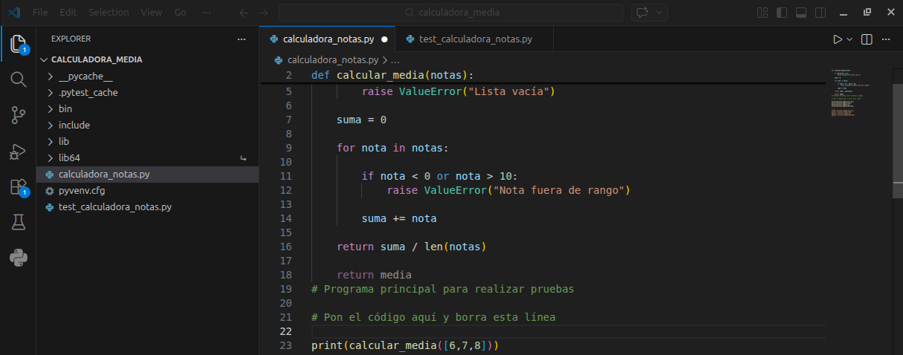
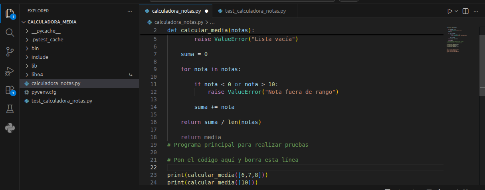
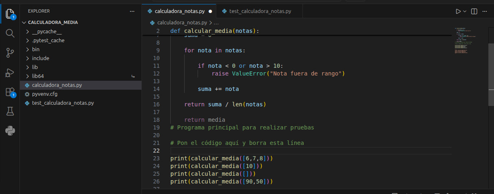
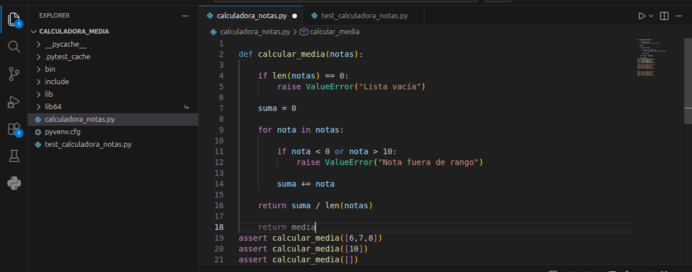
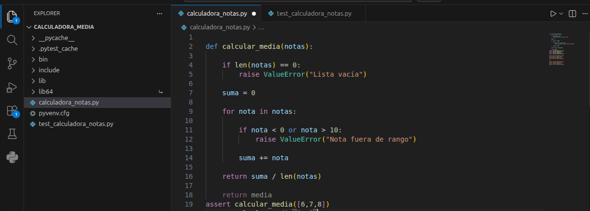
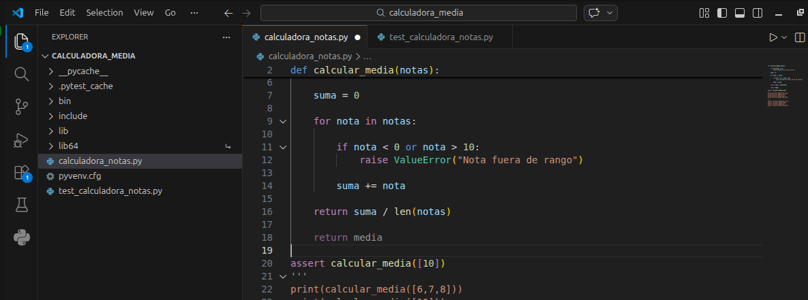
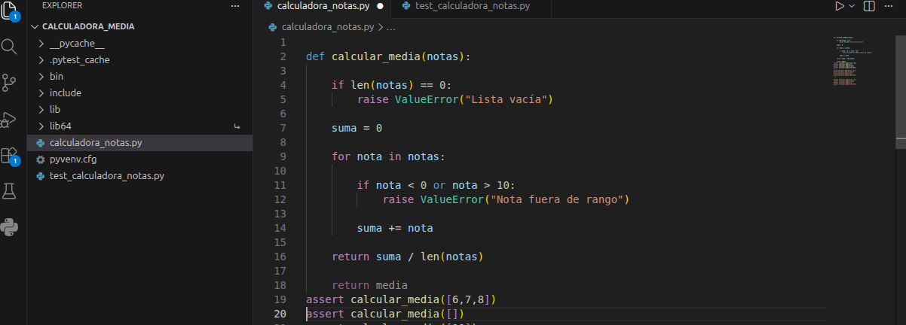
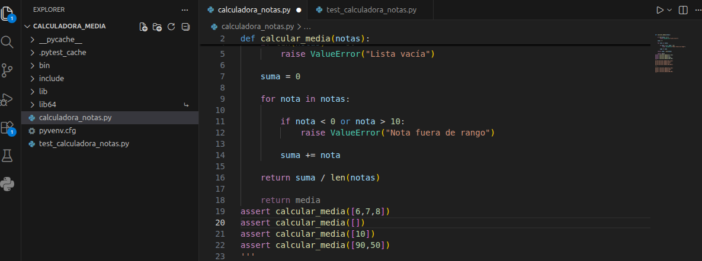
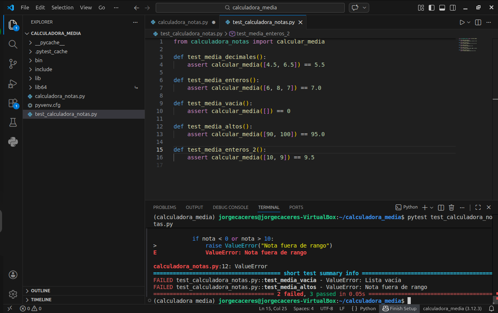

# UT6-A2 Introducción a las pruebas en Python con pytest

### Objetivo de la práctica

El objetivo de esta práctica es aprender a comprobar el funcionamiento de un programa utilizando diferentes técnicas de prueba:

1. pruebas manuales
2. comprobaciones con `assert`
3. pruebas automatizadas con `pytest`

### Descripción del programa

Se proporciona una función que calcula la **nota media de un alumno** a partir de una lista de calificaciones.

Las reglas que debe cumplir la función son:

- Recibe una lista de números.
- Cada nota debe estar entre **0 y 10**.
- Devuelve la **media aritmética** de las notas.
- Si la lista está vacía se debe producir un **error**.
- Si una nota no es válida se debe producir un **error**.

```python
def calcular_media(notas):

    if len(notas) == 0:
        raise ValueError("Lista vacía")

    suma = 0

    for nota in notas:

        if nota < 0 or nota > 10:
            raise ValueError("Nota fuera de rango")

        suma += nota

    return suma // len(notas)
```

### Puebas manuales

Crea un pequeño programa llamado `calculadora_notas.py` que utilice la función `calcular_media` y prueba distintos casos.

Debes comprobar al menos:

- varias notas

- una sola nota

- lista vacía

- nota fuera de rango

Usa la función `print()` para observar los resultados.

Inserta el código del programa aquí:

```python

def calcular_media(notas):

    if len(notas) == 0:
        raise ValueError("Lista vacía")

    suma = 0

    for nota in notas:

        if nota < 0 or nota > 10:
            raise ValueError("Nota fuera de rango")

        suma += nota

    return suma / len(notas)

    return media
```

Adjunta una captura de pantalla de la terminal de:

+ Varias notas:



+ Una sola nota:



+ Lista vacía



+ Nota fuera de rango



### Uso de **assert**

Sustituye las comprobaciones manuales por verificaciones usando **assert**.

>NOTA: En lugar de sustituirlas crea líneas de código nuevas y comenta las anteriores

Ejemplo:

```python
assert calcular_media([6,7,8]) == 7
```

Inserta el código del programa aquí:

```python
assert calcular_media([6,7,8])==7
assert calcular_media([10])==10
assert calcular_media([])=='Lista Vacia'
assert calcular_media([90,50])'Nota fuera de rango'

```


Adjunta una captura de pantalla de la terminal de:

- Varias notas:



- Una sola nota:



- Lista vacía



- Nota fuera de rango



### Test con **pytest**

Instala pytest en tu entorno:

```python
pip install pytest
```
Crea un archivo llamado `test_calculadora_notas.py` en el que debes implementar **al menos 5 tests**, incluyendo:

+ Cálculo correcto de media
+ Media con decimales
+ Lista vacía
+ Nota fuera de rango

### Ejecutar los tests

Ejecuta en la terminal el comando `pytest`, si todos los tests son correctos debe aparecer un resultado similar a :

```python
5 passed
```


### Entrega

Debes entregar a traves de tu repositorio de **GitHub** los siguientes archivos:

- Este archivo `README.md` con las capturas de pantalla e inserciones de  solicitadas.
- El archivo `calculadora_notas.py`
- El archivo `test_calculadora_notas.py`

