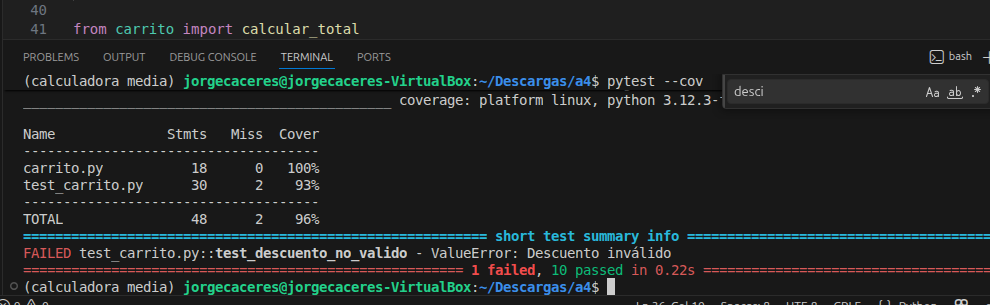

# UT6-A4 Diseño de tests para un gestor de carrito de compra

### Contexto

Una tienda online está desarrollando un pequeño módulo que gestiona el cálculo del importe de un carrito de compra.

El equipo de desarrollo ha implementado varias funciones, pero **el equipo de QA (vosotros)** debe diseñar los tests que verifiquen su correcto funcionamiento.

El objetivo de esta práctica es **diseñar e implementar una batería completa de tests usando `pytest` y comprobar la cobertura de código con `pytest-cov`**


### Comportamiento del sistema

El módulo permite realizar las siguientes operaciones:

#### 1. Calcular el subtotal de un carrito

- Función `calcular_subtotal(carrito)`
- El carrito es una lista de productos.
- Cada producto es un diccionario con **nombre, precio y cantidad**, por ejemplo:

```python
[
 {"nombre":"teclado","precio":30,"cantidad":2},
 {"nombre":"raton","precio":10,"cantidad":1}
]
```
- El subtotal se calcula haciendo la operación `precio * cantidad` para cada producto.

#### 2. Aplicar descuento

- Función `aplicar_descuento(subtotal, descuento)`
- El descuento es un porcentaje entre 0 y 100
- El resultado es el subtotal menos el porcentaje indicado, por ejemplo:

```
subtotal = 100
descuento = 10

resultado = 90
```
#### 3. Calcular gastos de envío

- Función `calcular_envio(subtotal)`
- Si subtotal >= 100 → envío gratis
- Si subtotal < 100 → envío 5€

#### 4. Calcular total del pedido

- Función `calcular_total(carrito, descuento)`


### Trabajo a realizar

Teniendo en cuenta que el proceso que se debe cumplir es:

<center>

### SUBTOTAL -> APLICAR DESCUENTO -> AÑADIR ENVÍO

</center>


Debes diseñar una batería de tests utilizando ``pytest`` que verifique el comportamiento del sistema.

Tus tests deben cubrir al menos:

**Subtotal**

+ carrito con varios productos
+ carrito con un solo producto
+ carrito vacío

**Descuentos**

+ descuento 0%

+ descuento válido

+ descuento 100%

+ descuento inválido

**Envío**

+ subtotal menor que 100

+ subtotal mayor o igual que 100

**Total del pedido**

+ pedido sin descuento

+ pedido con descuento

+ pedido con envío gratis

Para ello debes crear un archivo denominado ``test_carrito.py`` con **al menos 12 test distintos**

Una vez implementados los tests debes analizar **qué porcentaje del código está siendo ejecutado por las pruebas**.

Para ello utilizaremos la herramienta **pytest-cov**, que permite medir la cobertura de código.

Ejecuta el siguiente comando en la terminal dentro del proyecto ``pytest --cov`` y a continuación aporta una captura de pantalla con el resultado :



### Análisis de errores detectados

Durante la ejecución de los tests es posible que algunos de ellos fallen. Esto puede indicar que el código contiene errores.

Responde a las siguientes preguntas en este documento.

### 1. Tests que han fallado

Indica qué tests han fallado durante la ejecución inicial. Explica brevemente por qué esos tests deberían pasar según el comportamiento descrito en el enunciado.

A pesar de tener  13 test en total, como podemos apreciar en la cobertura del codigo solo pasan 11 en total (1 fallido, 10 correctos), mi teoría es que puede haber test que no se estén ejecutando correctamente debido a un posible fallo de sintaxis. Además el test que sale "failed" es debido a que el descuento es invalido


### 2. Identificación de errores en el código

Si has detectado errores en el programa, indica:

- en qué función se encuentran
- qué línea del código es incorrecta
- por qué produce un resultado incorrecto

En el código había un error en la linea 17, ya que solamente hacia un descuento de centimos, no del subtotal.el error se encuentra     'return subtotal - ( descuento  / 100)'.

 


### 3. Corrección propuesta

Explica cómo se debería corregir el código para que el comportamiento sea el esperado.

A continuación incluye el fragmento de código corregido.

'return subtotal - (subtotal * descuento  / 100)'.


### 4. Resultado final

Tras diseñar los tests y analizar el código:

- ¿cuántos tests has implementado?
Se han implementado 13 test
- ¿qué porcentaje de cobertura has obtenido?
la cobertura obtenida fue de un 96%
- ¿todos los tests pasan correctamente?
No, algunos test no llegan a comprobarse mientras que uno falla debido a que el descuento es invalido.
