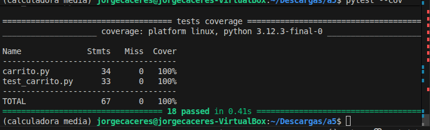

## UT6-A5 Testing avanzado de un carrito de compra
### Contexto


Una tienda online está ampliando su sistema de gestión de pedidos. El módulo de carrito de compra ha evolucionado y ahora incluye nuevas funcionalidades como cupones de descuento e impuestos.


El equipo de desarrollo ha implementado el código, pero el equipo de QA (vosotros) debe diseñar una batería completa de tests que verifique su correcto funcionamiento.


### Objetivo


Diseñar e implementar una batería de tests utilizando **pytest** que permita:


+ Validar el comportamiento completo del sistema
+ Detectar posibles errores en la implementación
+ Analizar la cobertura de código mediante pytest-cov


### Comportamiento del sistema


El módulo dispone de las siguientes funciones:


1. Calcular subtotal


  + Función: ``calcular_subtotal(carrito)``
  + El carrito es una lista de productos
  + Cada producto tiene:
    + ``nombre : string``
    + ``precio : float``
    + ``cantidad : int``


Ejemplo:


```python
[
{"nombre":"teclado","precio":30,"cantidad":2},
{"nombre":"raton","precio":10,"cantidad":1}
]
```
+ El subtotal se calcula como: ``precio * cantidad``
+ Consideraciones:
 + El carrito puede estar vacío
 + No se permiten precios negativos
 + No se permiten cantidades negativas


2. Aplicar descuento


+ Función: ``aplicar_descuento(subtotal, descuento)``


+ El descuento es un porcentaje (0–100)


Ejemplo:
```
subtotal = 100
descuento = 10
resultado = 90
```


+ Consideraciones:
 + 0% → no modifica el subtotal
 + 100% → total 0
 + Valores fuera de rango → error


3. Aplicar cupón


+ Función: ``aplicar_cupon(subtotal, cupon)``


Cupones disponibles:


+ WELCOME10 → 10% de descuento
+ FREESHIP → envío gratis
+ Otros cupones → inválidos


4. Calcular gastos de envío


+ Función: ``calcular_envio(subtotal)``


 + Si subtotal ≥ 100 → envío gratis
 + Si subtotal < 100 → 5€


5. Calcular impuestos


+ Función: ``calcular_impuestos(subtotal)``


 + Se aplica un 7% de IGIC


6. Calcular total del pedido


+ Función: ``calcular_total(carrito, descuento, cupon)``


El flujo completo es: ``SUBTOTAL → DESCUENTO → CUPÓN → ENVÍO → IMPUESTOS → TOTAL``


### Trabajo a realizar


Debéis diseñar una batería de tests en un archivo ``test_carrito.py`` cuempliendo los requisitos:


Requisitos mínimos:


+ Subtotal
 + carrito con varios productos
 + carrito con un solo producto
 + carrito vacío
 + valores inválidos (precio o cantidad negativa)
 + Descuentos
 + descuento 0%
 + descuento válido
 + descuento 100%
 + descuento inválido (>100 o negativo)
 + Cupones
 + cupón válido (WELCOME10)
 + cupón de envío gratis (FREESHIP)
 + cupón inválido
 + Envío
 + subtotal menor que 100
 + subtotal mayor o igual que 100
 
+ Impuestos
 + cálculo correcto del 7%
 + redondeo a 2 decimales


+ Total del pedido
 + pedido sin descuento
 + pedido con descuento
 + pedido con cupón
 + pedido con envío gratis
 + combinación de todos los elementos


Requisitos obligatorios:


+ Mínimo 15 tests
+ Uso de: ``pytest`` y  ``pytest-cov``


+ Incluir:
 + **Tests parametrizado**s (``@pytest.mark.parametrize``). Los tests parametrizados permiten ejecutar el mismo test varias veces con distintos valores de entrada, evitando duplicar código. Son especialmente útiles cuando quieres comprobar un mismo comportamiento con diferentes casos. Por ejemplo :


```python
import pytest


@pytest.mark.parametrize("subtotal,descuento,resultado_esperado", [
   (100, 0, 100),
   (100, 10, 90),
   (100, 100, 0),
])
def test_aplicar_descuento(subtotal, descuento, resultado_esperado):
   assert aplicar_descuento(subtotal, descuento) == resultado_esperado
```
**"subtotal,descuento,resultado_esperado"** → nombres de los parámetros
La lista contiene los distintos casos de prueba. El test se ejecuta automáticamente una vez por cada tupla. En este ejemplo se ejecutan 3 tests distintos con una sola función.


 + **Tests de excepciones**. Sirven para comprobar que el programa responde correctamente ante errores o valores inválidos. En lugar de verificar un resultado, verifican que se produce una excepción.


```python
import pytest


def test_descuento_invalido():
   with pytest.raises(ValueError):
       aplicar_descuento(100, 150)
```
+ pytest.raises(ValueError) indica que esperamos una excepción
+ El test solo pasa si la excepción ocurre
+ Si no ocurre → el test falla


**¿Cuándo usar cada uno?**


Usa tests parametrizados cuando:
+ Hay muchos casos similares
+ Cambian solo los datos de entrada
+ Quieres evitar repetir código


Ejemplo:


+ descuentos
+ cálculos matemáticos
+ diferentes combinaciones de entrada


Usa tests de excepciones cuando:
+ Hay valores inválidos
+ El sistema debe rechazar datos incorrectos


Ejemplo:


+ descuento negativo
+ precio negativo
+ cupón inválido


En esta práctica deberías usar:


+ Tests parametrizados → para probar múltiples combinaciones (descuentos, subtotales…)
+ Tests de excepciones → para validar errores del sistema


### Cobertura


Debes alcanzar al menos un 85% de cobertura de código. Incluye a continuación una captura de pantalla de la cobertura de código:





### Análisis de errores


A continuación responde a las siguientes preguntas:


1. Tests que han fallado
Al principio del proceso de la elaboración de los test hemos tenido dificultades para obtener correctamente los impuestos debido a que en esa función tenía un error, el cual explicaremos más adelante.
+ Indica cuáles fallan inicialmente
Los test fallidos estaban relacionados con los impuestos.
+ Explica por qué deberían pasar
No deberían haber pasado los test debido a que los impuesto estaban incorrectamente calculados.


2. Identificación de errores
+ Función donde se encuentra el error
El error se encuentra en la función calcular_impuestos
+ Línea incorrecta
La linea incorrecta es la 32.
+ Explicación del problema
El error es que a  la hora de calcular los impuestos, estos eran multiplicados por el 70 % en vez del 7 %, esto debido a que la linea era "subtotal * 0.7".


3. Corrección propuesta
+ Explicación de la solución
La posible solución al problema puede ser "round(subtotal * 0.07,2)" ya que ahí calcula el 7 % además de redondearlo a dos cifras decimales, en lugar del 70 % erróneo.
+ Código corregido


```python
def calcular_impuestos(subtotal):
   return round(subtotal * 0.07, 2)
```


4. Resultado final
  + Número de tests implementados
  Hemos implementado 18 test en total.
  + Cobertura obtenida
  La cobertura obtenida fue de un 100 %.
  + ¿Todos los tests pasan?
  Todos los test implementados pasan correctamente.
